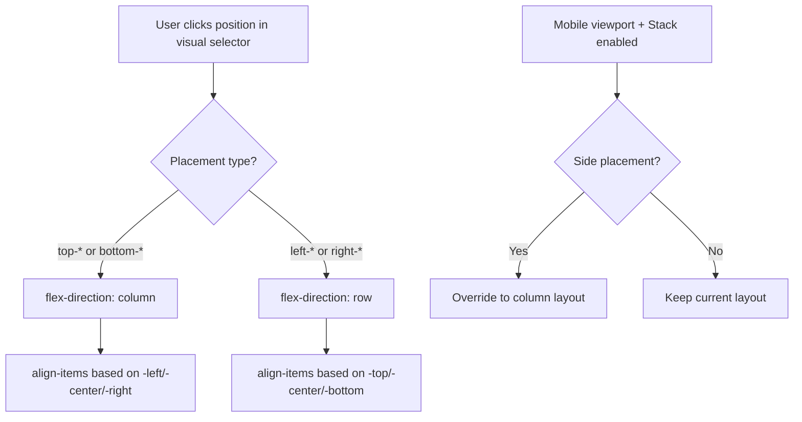

# Design Document: Caption Placement Expansion

## Overview

This feature extends the Collage Image block's caption placement system to support left and right positioning in addition to the existing bottom placements. This enables magazine-style layouts where captions sit beside images rather than below them, a common pattern in photo books and editorial design.

The implementation leverages CSS Flexbox to switch between column (bottom captions) and row (side captions) layouts, with additional controls for caption width and vertical alignment when using side placements.

## Architecture

The feature modifies four main areas:

1. **Block Attributes** (`block.json`) - Expand `captionPlacement` options from 3 to 12
2. **Editor Component** (`edit.js`) - Add visual position selector, update preview rendering
3. **Server Renderer** (`class-photo-collage-renderer.php`) - Update PHP rendering logic for new positions
4. **Styles** (`style.scss`, `editor.scss`) - Add position selector styles and responsive behavior



## Components and Interfaces

### Block Attributes

Update `captionPlacement` attribute options to include all 12 positions:

**Top positions (caption above image):**
- `top-left`, `top-center`, `top-right`

**Side positions (caption beside image):**
- `left-top`, `left-center`, `left-bottom` (caption to left, aligned top/center/bottom)
- `right-top`, `right-center`, `right-bottom` (caption to right, aligned top/center/bottom)

**Bottom positions (caption below image):**
- `bottom-left`, `bottom-center`, `bottom-right`

### Editor Component Changes

The `edit.js` component needs:

1. **Visual Position Selector** - A grid showing all 12 caption positions around a center image representation
2. **Updated figure styles** - switch between row/column based on placement
3. **DOM order handling** - caption before image for "left-*" and "top-*", after for "right-*" and "bottom-*"

#### Visual Position Selector Design

Create a custom **CaptionPositionControl** component that displays all 12 positions in a unified, intuitive visual interface. The design represents the image as a central area with clickable caption zones around all four edges.

```
┌──────────────────────────────────────────┐
│  Caption Position                        │
│                                          │
│       ┌────┬────┬────┐                   │
│       │ TL │ TC │ TR │  ← 3 top buttons  │
│  ┌────┼────┴────┴────┼────┐              │
│  │ LT │              │ RT │              │
│  ├────┤              ├────┤              │
│  │ LC │      🖼️     │ RC │ ← 3 per side │
│  ├────┤    IMAGE    ├────┤              │
│  │ LB │              │ RB │              │
│  └────┼────┬────┬────┼────┘              │
│       │ BL │ BC │ BR │  ← 3 bottom btns  │
│       └────┴────┴────┘                   │
│                                          │
└──────────────────────────────────────────┘
```

**Visual Design Principles (WordPress-aligned):**

1. **Spatial representation** - Layout visually shows where caption appears relative to image
2. **Single click selection** - All 12 positions accessible with one click, no dropdowns
3. **WordPress styling** - Uses `--wp-admin-theme-color` for active state, standard button styles
4. **Compact footprint** - ~180px wide, fits comfortably in inspector panel
5. **Clear feedback** - Hover and active states match WordPress component patterns

**Implementation using CSS Grid:**

```css
.caption-position-control {
  display: grid;
  grid-template-columns: 28px 1fr 28px;
  grid-template-rows: 28px 1fr 28px;
  gap: 2px;
  width: 180px;
}

.caption-position-top {
  grid-column: 2;
  grid-row: 1;
  display: flex;
  gap: 2px;
}

.caption-position-left {
  grid-column: 1;
  grid-row: 2;
  display: flex;
  flex-direction: column;
  gap: 2px;
}

.caption-position-center {
  grid-column: 2;
  grid-row: 2;
  background: #f0f0f0;
  border: 1px dashed #ccc;
  display: flex;
  align-items: center;
  justify-content: center;
  min-height: 50px;
}

.caption-position-right {
  grid-column: 3;
  grid-row: 2;
  display: flex;
  flex-direction: column;
  gap: 2px;
}

.caption-position-bottom {
  grid-column: 2;
  grid-row: 3;
  display: flex;
  gap: 2px;
}
```

**Button States:**
- Default: `background: #f0f0f0; border: 1px solid #ddd;`
- Hover: `background: #e0e0e0;`
- Active: `background: var(--wp-admin-theme-color); color: white;`
- Focus: Standard WordPress focus ring

**Accessibility:**
- Each button has `aria-label` (e.g., "Caption position: bottom left")
- Keyboard navigation with Tab key
- Focus visible states using WordPress standard outline
- Current selection announced to screen readers

### Server Renderer Changes

The `render_inner_html` method in `Photo_Collage_Renderer` needs:

1. **Detect side placement** - check if placement is "left" or "right"
2. **Generate row layout styles** - `flex-direction: row` for side placements
3. **Apply vertical alignment** - map to `align-items` CSS property
4. **Handle DOM order** - render caption before or after image based on placement

### Style Changes

Add CSS for:
1. **Side caption layout** - ensure image and caption share horizontal space
2. **Mobile responsive override** - stack side captions on mobile when enabled

## Data Models

### Attribute Schema

| Attribute | Type | Default | Description |
|-----------|------|---------|-------------|
| `captionPlacement` | string | `"bottom-left"` | Position: 12 options (see below) |
| `captionWidth` | string | `"100%"` | Width of caption area (applies to all placements) |
| `captionAlign` | string | `"left"` | Text alignment within caption |

### CSS Property Mapping

| Placement | flex-direction | Caption Order | align-items |
|-----------|---------------|---------------|-------------|
| top-left | column | before image | flex-start |
| top-center | column | before image | center |
| top-right | column | before image | flex-end |
| left-top | row | before image | flex-start |
| left-center | row | before image | center |
| left-bottom | row | before image | flex-end |
| right-top | row | after image | flex-start |
| right-center | row | after image | center |
| right-bottom | row | after image | flex-end |
| bottom-left | column | after image | flex-start |
| bottom-center | column | after image | center |
| bottom-right | column | after image | flex-end |

## Correctness Properties

*A property is a characteristic or behavior that should hold true across all valid executions of a system-essentially, a formal statement about what the system should do. Properties serve as the bridge between human-readable specifications and machine-verifiable correctness guarantees.*

### Property 1: Side placement uses row layout
*For any* caption placement value starting with "left-" or "right-", the rendered figure element SHALL have `flex-direction: row` applied.
**Validates: Requirements 1.3**

### Property 2: Top and bottom placement uses column layout
*For any* caption placement value starting with "top-" or "bottom-", the rendered figure element SHALL have `flex-direction: column` applied.
**Validates: Requirements 1.4**

### Property 3: Caption width is applied
*For any* caption width value and any caption placement, the rendered figcaption element SHALL have the specified width applied as a CSS style.
**Validates: Requirements 2.2**

### Property 4: Horizontal alignment maps to CSS correctly
*For any* caption placement value, the rendered figure element SHALL have the corresponding `align-items` CSS value based on the placement position (left positions→flex-start, center positions→center, right positions→flex-end).
**Validates: Requirements 1.2, 1.3**

### Property 5: Editor and server render consistency
*For any* valid combination of caption attributes, the CSS styles generated by the editor component SHALL match the CSS styles generated by the server-side renderer.
**Validates: Requirements 4.1, 4.2, 4.3**

### Property 6: Top and left placements render caption before image
*For any* caption placement starting with "left-" or "top-", the caption element SHALL appear before the image element in the DOM order.
**Validates: Requirements 1.3**

### Property 7: Right and bottom placements render caption after image
*For any* caption placement starting with "right-" or "bottom-", the caption element SHALL appear after the image element in the DOM order.
**Validates: Requirements 1.3, 1.4**

## Error Handling

| Scenario | Handling |
|----------|----------|
| Invalid placement value | Fall back to "bottom-left" |
| Invalid vertical alignment | Fall back to "top" |
| Empty caption with side placement | Hide caption, image takes full width |
| Missing captionVerticalAlign attribute | Use default "top" |

## Testing Strategy

### Property-Based Testing

Use `fast-check` for JavaScript property-based tests. Each correctness property will have a corresponding PBT that generates random valid attribute combinations and verifies the property holds.

Test configuration:
- Minimum 100 iterations per property
- Generate random placement values from valid set
- Generate random vertical alignment values from valid set
- Generate random caption width values (valid CSS units)

### Unit Tests

1. **Attribute defaults** - Verify new attribute has correct default
2. **UI control visibility** - Vertical alignment shown/hidden based on placement
3. **SelectControl options** - All 5 placement options present
4. **Style generation** - Correct CSS for each placement/alignment combination

### Integration Tests

1. **Editor preview** - Visual regression for each placement option
2. **Server render** - PHP output matches expected HTML structure
3. **Mobile responsive** - Side captions stack on mobile viewport
